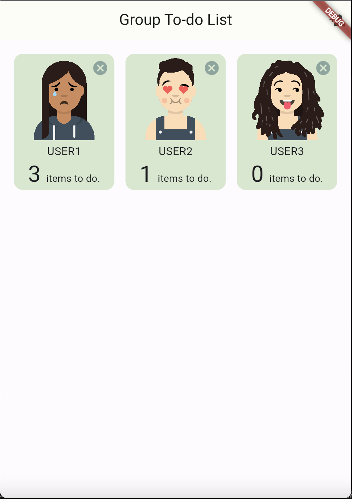
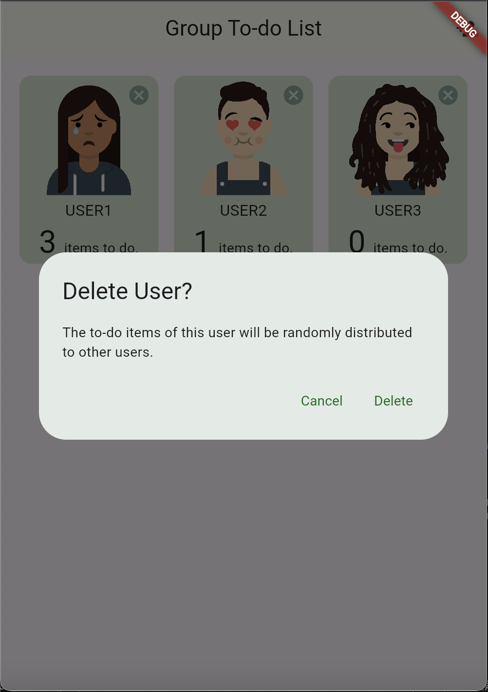
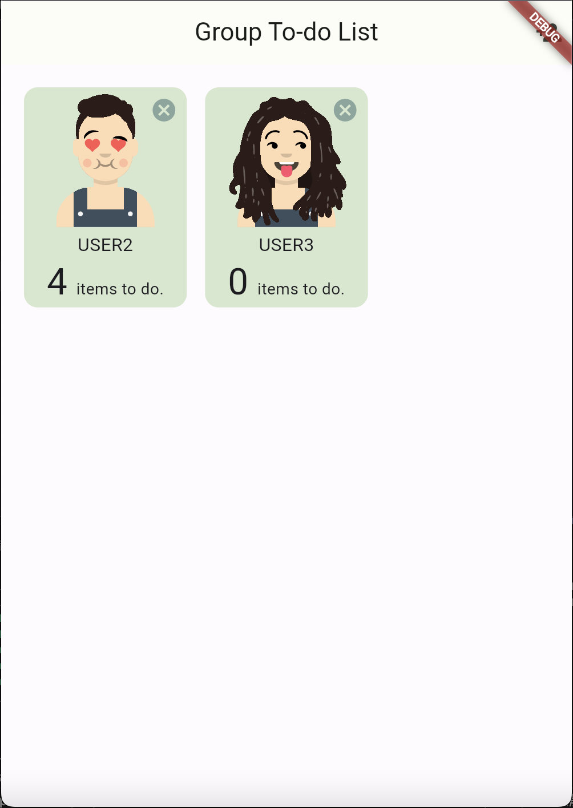

# Group todo list app

In the project, we built a group to-do list app with Firebase. We enabled functionalities to add users and their respective to-do items, as well as implemented user deletion functionality with reassignment of the deleted user's to-do items to remaining users.

### Hint:
The **firebase_options.dart** file is not uploaded to this repository. Therefore, the Firebase service will not be functional if you just clone the repository without deploying your own Firestore database and Firebase functions.

## Featrues
- **User Deletion UI** A delete button. When button is pressed, show a confirm dialog.

- **User Deletion Functionality** Press delete in confirm dialog, delete the user.

- **Orphan Item Re-distribution** Randomly re-distribute orphan items to one of the other users.

## Description

1. There is a “delete” button at top-right corner of user grid item.

2. Upon clicking the delete button, display a confirmation dialog to prevent accidental deletions. 
Confirming the deletion should subsequently remove the user from the database.
 

3. While deletion operations via Firestore API are not recursive, to-do items under deleted user document are orphans.

4. So there is an idempotent cloud function to re-distribute orphan items to one of the other users.
 

## Resource

- [Firebase Setup](https://firebase.google.com/docs/cli?hl=zh-tw)

- [JavaScript Promise](https://javascript.info/async)

